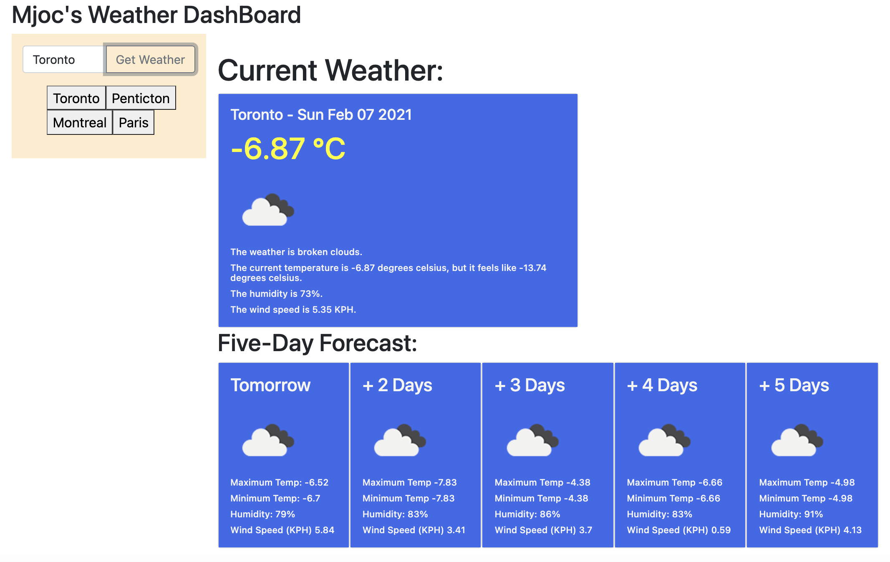

# Assignment06
This is the repo for the Weather Dashboard Assignment 06, due February 2, 2021.

# Unit 06 Javascript Homework: Weather Dashboard

Submitted: February 7, 2021, Michael O'Connor, WebDev Wannabe, 604 765-6061

# 01 Goal: The goal is to build a weather dashboard that will run in the browser and feature dynamically updated HTML and CSS.Here is a link to the Github folder https://github.com/Emjayosee/Assignment06 and a link to the deployed website https://emjayosee.github.io/Assignment06/.

# 02 Approach:

    In approching this project, started by getting an API key from the recommended weather platform. I then used the class example to replicate a fetch from openweathermap.org.  Once I got that working with the help of TA, I replicated that and then built the forecast.  With help from Tutor I got the local storage going.  I gave up trying to create a loop since there was only 5 cards to display, but I realize I need to work on my loops.

    I followed the following plan design:

        Weather Map

            Goal: To Build a weather dashboard

            TBD.

            Design:
            •	Main page with a weather dashboard;
            •	Need to have a search capability to look for specific cities;
            •	Needs to display a five day forecast;
            •	Needs to display the current weather;
            
            Here is the basic logic flow (ignoring the high score feature):

                [X] Present current and future conditions for that city
                [X] City is added to the search history
                [X] Presented with the city name, the date, an icon representation of weather conditions, the temperature the humidity, the wind speed, and the UV index (NOTE UV INDEX NOT AVAILABLE)
                [ ] Present UV INDEX as color that indicates whether the conditions are favorable, moderate, or severe
                [X] Presented a 5-day forecast that displays the date, an icon representation of weather conditions, the temperature, and the humidity, added other features
                [ ] When clicking on a city in the search history present current and future conditions for that city

            Build:
            •	Set up three files, index.html, script.js and style.css (add to Github) [x]
            •	HTML:
                >   Try using shoelace to Layout the desired dashboard [X ] DID NOT WORK WELL
                >   Add current weather bar [X]
                >   Add Card Components [X] done via JS
                >   Add search bar on the Left side where cities will be displayed [X ]
                

            •	JavaScript: 
                > Set up the get API
                > Seek TAs help on API protocol, but was able to create the forecast one on my own
                > Seek Tutor's help on Local Storage, but I later worked out ho to convert to buttons
            •	CSS:
                >Stylish background image and footer styling [x]

            Validation:
            •	formated the code

# 03 Testing and Quality Control:

    1. Test each of the criteria to confirm functionality.

    2. Format HTML Code to make it easier to follow when viewed at source.

    3. Load the files and tested the page functionality at GITHUB.

    6. Run the html through a code validation service on the final commit.  Use validator.w3.org and describe any issues and resolution.  Adjust before the final commit. Some duplicate attribute issues, but does not seem to impact results.

# 04 Lessons Learned:

The following items should be considered for future enhancements, time and budget permitting:

    1. How to get an API key.

    2. HOw top work with localStorage

    3. Some limited JQuery, and why I should try to do Assignment 05.

# 05 Further improvements to make:

    1. Have the dashboard emailed to me once a day.

    2. Add the seach of previous cities.

# 06 Current Renderings:

See Current Rendering at the time of writing in the Assignment04 Repo. 

